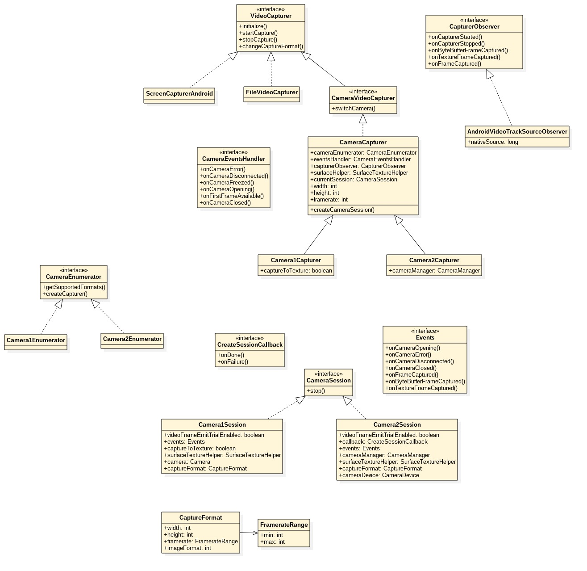

```C++
private VideoTrack createVideoTrack(VideoCapturer capturer) {
    videoSource = factory.createVideoSource(capturer);
    capturer.startCapture(videoWidth, videoHeight, videoFps);

    localVideoTrack = factory.createVideoTrack(VIDEO_TRACK_ID, videoSource);
    localVideoTrack.setEnabled(renderVideo);
    localVideoTrack.addSink(localRender);
    return localVideoTrack;
}
```


# 参考文献
1. [webrtc源码分析之视频采集之一](https://www.jianshu.com/p/5902d4953ed9)
2. [webrtc源码分析之视频采集之二](https://www.jianshu.com/p/5624f1f0d8ee)


